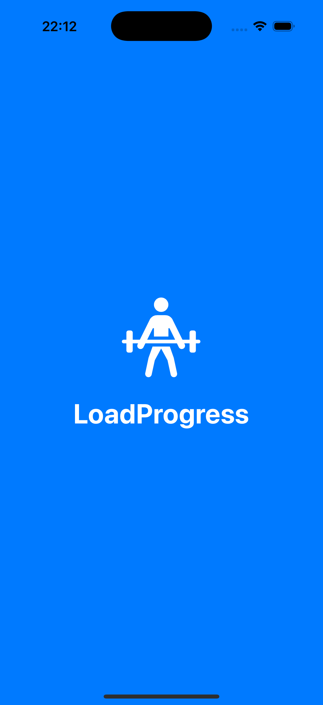
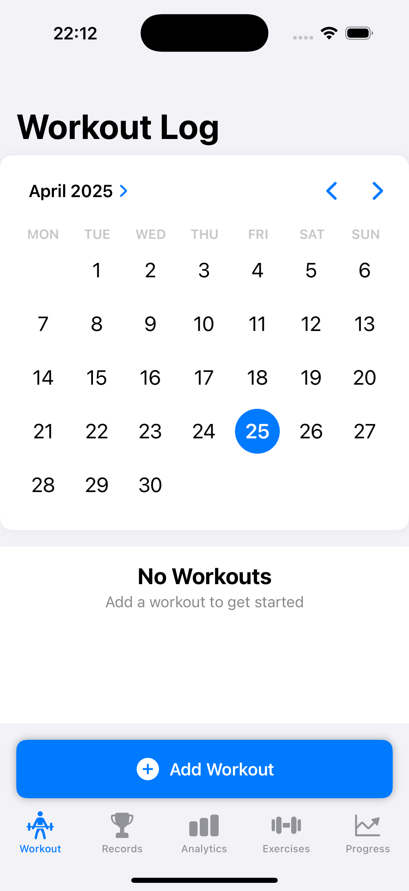
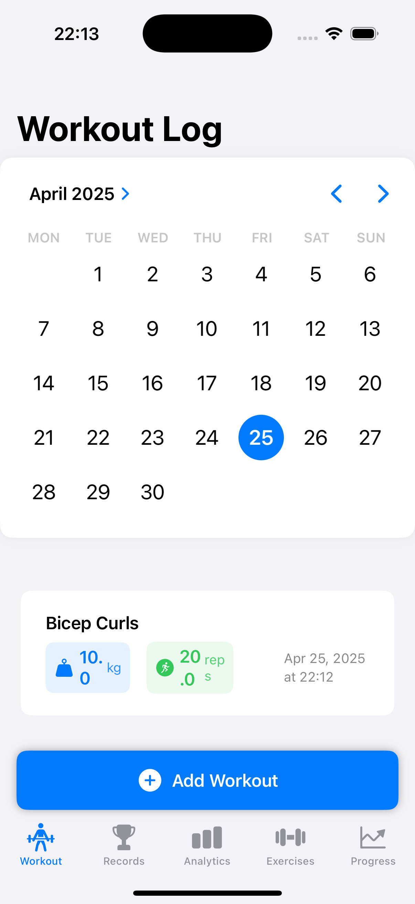
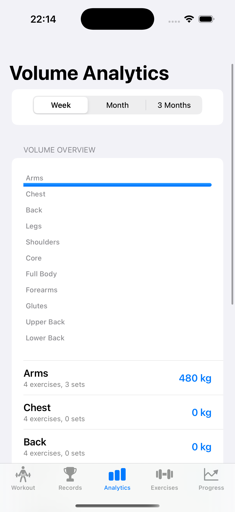
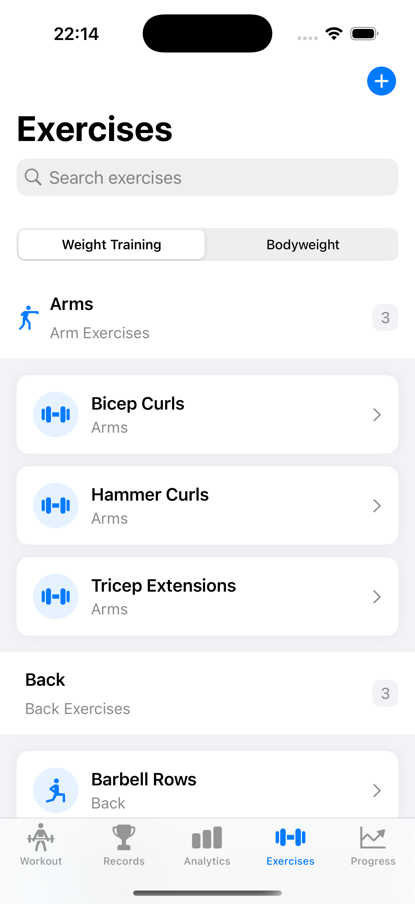
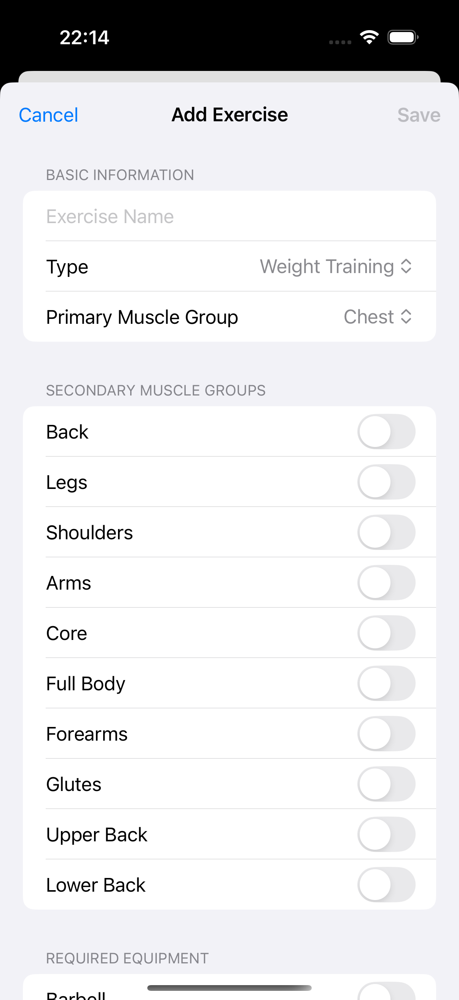
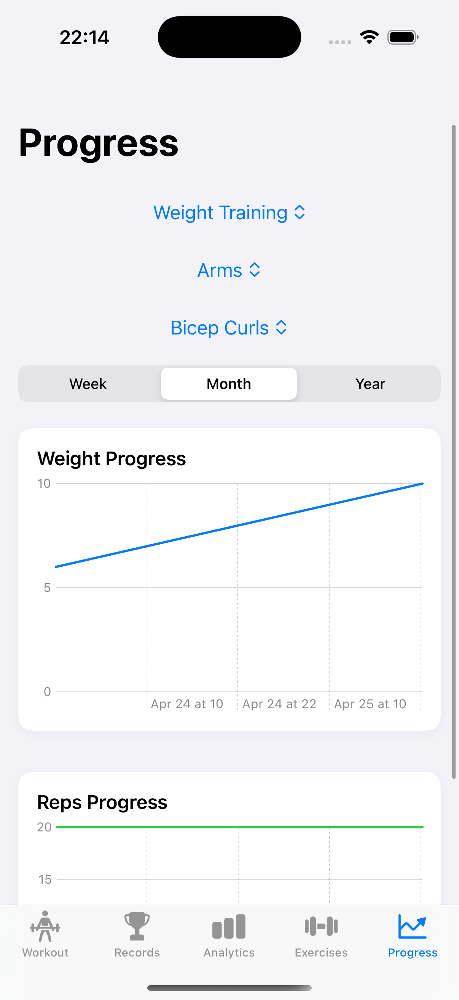
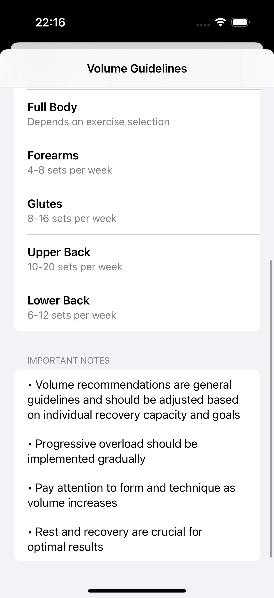

# LoadProgress


LoadProgress is an iOS application designed for tracking workout progress with a focus on progressive overload - the gradual increase of stress placed upon the body during exercise training.

## Features

- **Exercise/Workout Tracking**: Log your workouts with detailed exercise information
- **Data Management**: Efficiently store and retrieve your workout data
- **Progress Visualization**: Track your progress over time with intuitive visualizations
- **PR Tracking**: Record and celebrate your personal records
- **Volume Analytics**: Analyze your workout volume and intensity
- **Rest Timer**: Built-in timer for tracking rest periods between sets
- **Form Check**: Tools to help ensure proper exercise form
- **Splash Screen**: Initial loading screen for better user experience

## Architecture

LoadProgress follows the MVVM (Model-View-ViewModel) architecture pattern for clean separation of concerns:

- **Models**: Data structures representing the core entities
- **Views**: SwiftUI views for the user interface
- **Managers**: Business logic and data handling
- **Utilities**: Helper functions and extensions

## Screenshots
| Splash Screen | Home Screen | Exercise Log |
| --- | --- | --- |
|  |  |  |
---
| Volume Analysis | Exercise List | Add Exercise |
| --- | --- | --- |
|  |  |  |
---
| Progress Trend | Volume Guide |  |
| --- | --- | --- |
|  |  |  |

## Getting Started

### Prerequisites

- Xcode 15.0+
- iOS 18.0+
- Swift 5.0+

### Installation

1. Clone the repository:
```bash
git clone https://github.com/nitishmalpotra/LoadProgress.git
```

2. Open the project in Xcode:
```bash
cd LoadProgress
open LoadProgress.xcodeproj
```

3. Build and run the application on your simulator or device.

## Roadmap

The development of LoadProgress is planned in three phases:

1. **Phase 1: Core Progress Tracking**
   - PR tracking
   - Volume analytics
   - Rest timer
   - Form check features

2. **Phase 2: Smart Progressive Overload**
   - Progression planning
   - Pattern recognition
   - Workout templates

3. **Phase 3: Advanced Analytics**
   - Progress insights
   - Balance tracking
   - Predictive analysis
   - AI assistance

## Contributing

Contributions are welcome! Please feel free to submit a Pull Request.

## License

This project is licensed under the MIT License - see the LICENSE file for details.

## Acknowledgments

- Thanks to all contributors who have helped shape LoadProgress
- Inspired by the principles of progressive overload in strength training
