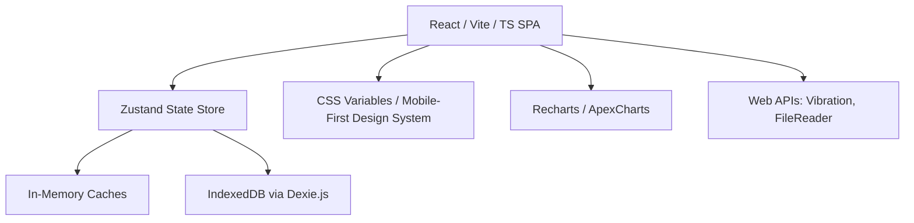

# LoadProgress - Codebase Analysis & Redesign Strategy

This document provides architectural context for **LoadProgress** and records the current redesign strategy for the web PWA.

The original iOS-to-web refactor is complete. The next product direction is a mobile-first redesign that keeps the local-first training engine but replaces the current dark glassmorphism UI with a light-first, phone-sized app experience.

---

## 📊 Codebase Evaluation & Rating

### Overall Score: **8.5 / 10**

LoadProgress is an exceptionally clean, well-engineered native iOS application. It stands out due to its strict adherence to modern design guidelines, performance optimizations, and logical separation of concerns.

| Category | Score | Key Observations |
| :--- | :---: | :--- |
| **Architecture & Structure** | **9.0 / 10** | Clean, textbook MVVM. Clear separation of data models, view models (Managers), and views. High documentation standards with dedicated README files in subdirectories. |
| **Code Quality & Patterns** | **8.5 / 10** | Strong use of immutable value types, async file handling, performance metrics, and caching. No third-party dependencies makes it highly maintainable. |
| **Data Persistence** | **6.5 / 10** | The use of `UserDefaults` for serializing large workout datasets in JSON limits the app to ~5,000 sets. CoreData, SwiftData, or SQLite would be better for scalability. |
| **UI/UX Implementation** | **9.0 / 10** | The "iOS 26 Liquid Glass" system is beautifully detailed in `Theme.swift`, using gradients, translucent materials, and spring-based animations. |
| **Test Coverage** | **7.5 / 10** | Good coverage for core logic (PR calculations, volume calculations) and performance. UI integration tests are present but basic. |

---

## 🔍 Screen-by-Screen & File Analysis

### 1. Data Layer (`Models/`)
*   [Exercise.swift](LoadProgress/Models/Exercise.swift): Models exercises with type (weight training vs. bodyweight), muscle group, secondary groups, icon, difficulty, equipment, and form cues. Includes validation using the `Validator` utility.
*   [WorkoutSet.swift](LoadProgress/Models/WorkoutSet.swift): Represents a single log entry. Contains strict initializer validation (e.g., reps > 0, weight > 0, future date prevention).
*   [PersonalRecord.swift](LoadProgress/Models/PersonalRecord.swift): Structures 1RM, volume, and reps-based personal records.
*   [VolumeMetrics.swift](LoadProgress/Models/VolumeMetrics.swift): Calculations helpers for muscle-group volume tracking.
*   [ExerciseIcon.swift](LoadProgress/Models/ExerciseIcon.swift): Defines icons for 50+ exercises.

### 2. Business Logic Layer (`Managers/`)
*   [DataManager.swift](LoadProgress/Managers/DataManager.swift): Acts as the main data repository. Implements incremental caching to speed up data access from $O(n)$ to $O(1)$, handles bulk operations, handles backup restoration, and manages `UserDefaults` encoding/decoding.
*   [PRManager.swift](LoadProgress/Managers/PRManager.swift): Orchestrates PR calculations using the Brzycki formula. Offloads calculations to a background thread `DispatchQueue` and posts updates via `NotificationCenter`.

### 3. Presentation Layer (`Views/`)
*   [ContentView.swift](LoadProgress/ContentView.swift): Tab container mapping the 5 core sections: **Workout**, **Records**, **Analytics**, **Exercises**, and **Progress**.
*   [Theme.swift](LoadProgress/Views/Styles/Theme.swift): The implementation engine of the "Liquid Glass" design system, using custom modifiers for glass backgrounds, custom spring-based buttons, typography scales, and shadows.
*   [VolumeAnalyticsView.swift](LoadProgress/Views/Analytics/VolumeAnalyticsView.swift) & [ProgressView.swift](LoadProgress/Views/ProgressView.swift): Utilize Swift Charts to display volume and weight/reps progression over time.

---

## Current Web App Audit

### Routes and Screens

- `/`: Workout log
- `/records`: Personal records placeholder/dashboard
- `/analytics`: Volume analytics
- `/exercises`: Exercise Library
- `/progress`: Progress trends
- `/styleguide`: Existing design-system preview

The app currently uses a responsive layout that becomes sidebar-first on desktop. The redesign should instead keep a phone-sized shell centered on desktop so the product feels like a mobile app everywhere.

### Library Failure

The Library detail flow is local state inside `ExercisesTab`, not a route. Clicking an exercise reproduced a live browser failure:

- Symptom: exercise click leaves `/exercises` without a usable detail view.
- Browser error: React `Maximum update depth exceeded`.
- Likely cause: `ExerciseDetail` uses `state.workoutSetsByExerciseId[exercise.id] ?? []`, returning a fresh empty array during store subscription for exercises with no logged sets.
- Redesign implication: fix the selector and give exercise detail an explicit back/recovery model.

### Visual Audit

- Current palette is dark navy/slate with teal and purple accents.
- Styling relies heavily on translucent glass panels, radial gradients, deep shadows, and large headings.
- Exercise icons are generic Lucide mappings by exercise name.
- Library should move toward muscle-first browsing and muscle-specific iconography.

## Mobile-First Product Model

- Working viewport: 360-430px.
- Desktop presentation: centered app shell, not a separate desktop dashboard.
- Navigation: bottom tabs remain primary.
- Secondary screens: visible top back action, recoverable browser history where appropriate.
- Primary jobs:
  - Workout: log today's training.
  - Library: browse/search/filter by muscle group.
  - Exercise detail: cues, requirements, target muscles, stats, and history.
  - Progress: drill into one exercise trend.
  - Volume: compare load by muscle group.
  - Records: review personal bests.

## Light-First Design System

- Background: `#F7F5F0`
- Surface: `#FFFFFF`
- Raised surface: `#F1EFE8`
- Text: `#171717`
- Secondary text: `#6B6963`
- Primary action: `#176B4D`
- Supporting chart/status colors may use amber, blue, red, and violet sparingly.

Design rules:

- Use compact app-scale typography instead of hero-scale headings.
- Use stable spacing tokens: `4`, `8`, `12`, `16`, `20`, and `24`.
- Keep most radii between `8px` and `14px`.
- Use cards for repeated items and tools only; avoid nested cards.
- Make loading, empty, and error states explicit and recoverable.
- Keep dark mode optional for a later token swap.

## Web Architecture Blueprint

LoadProgress should continue to maintain the **privacy-first, local-first** core philosophy.

### 1. Frontend Framework & Architecture
*   **Recommendation**: React with Vite and TypeScript (Single Page Application).
*   **Rationale**: Vite is extremely fast, SPA matches the local-first architecture perfectly (no backend latency), and TypeScript ensures type safety for models.
*   **State Management**: **Zustand** or React Context. Zustand mimics SwiftUI's `@Published` / `ObservableObject` reactive behavior perfectly with minimal boilerplate.

### 2. Local-First Storage (Replacing UserDefaults)
*   **Recommendation**: **IndexedDB** using **Dexie.js** (a lightweight wrapper).
*   **Rationale**:
    *   `UserDefaults` has a tight limit (~1-5MB). `localStorage` shares this 5MB limit.
    *   IndexedDB supports large datasets (hundreds of MBs), custom indexing, and asynchronous queries, making queries like `getWorkoutSets(for: date)` extremely fast and scalable.

### 3. Mobile-First Styling
*   **Backgrounds**: Warm neutral page background with white app surfaces.
*   **Shell**: Phone-sized app frame on desktop, full-width mobile app on small screens.
*   **Shadows**: Subtle elevation only where it clarifies hierarchy.
*   **Animations**: Fast, restrained transitions that support repeated workout logging.

### 4. Interactive Charts (Replacing Swift Charts)
*   **Recommendation**: **Recharts** or **ApexCharts**.
*   **Rationale**: Both libraries render beautiful, responsive SVG line/bar charts with smooth tooltips, customizable colors, and interactive zoom, matching Swift Charts' aesthetics.

### 5. Web Platform Capabilities (Replacing Native Features)
*   **Haptics**: Use the Web Vibration API (`navigator.vibrate([10])` for standard taps, `[15, 10, 15]` for records).
*   **Rest Timer**: Use standard JavaScript `setInterval` coupled with a **Web Worker** to guarantee that the timer runs accurately when the browser tab is backgrounded.
*   **Backup & Restore**: Use HTML5 `FileReader` and dynamically generated JSON blobs for local file exports/imports.
*   **Icons**: Use consistent muscle-specific exercise icons and simple Lucide navigation/action icons.

---

## 🗺 Refactoring Phases

